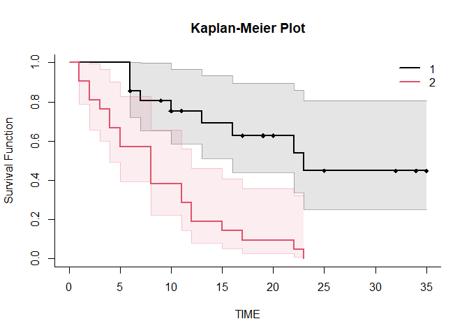

<!-- README.md is generated from README.Rmd. Please edit that file -->

# SurvivalFast

<!-- badges: start -->
<!-- badges: end -->

The goal of SurvivalFast is to …

## Installation

You can install the development version of SurvivalFast from
[GitHub](https://github.com/) with:

``` r
# install.packages("devtools")
devtools::install_github("Lin-Wei-Han/survivalFast")
```

## Example

This is a basic example which shows you how to solve a common problem:

``` r
library(SurvivalFast)
## basic example code
```

Remission times (in weeks) for two groups of leukemia patients:

``` r
summary(canser)
#>      Group          Week          Censord      
#>  Min.   :1.0   Min.   : 1.00   Min.   :0.0000  
#>  1st Qu.:1.0   1st Qu.: 6.00   1st Qu.:0.0000  
#>  Median :1.5   Median :10.50   Median :1.0000  
#>  Mean   :1.5   Mean   :12.88   Mean   :0.7143  
#>  3rd Qu.:2.0   3rd Qu.:18.50   3rd Qu.:1.0000  
#>  Max.   :2.0   Max.   :35.00   Max.   :1.0000
```

For example:

``` r
survivalFast(canser$Week,            # 時間(必填)
             canser$Censord,         # 設限(必填)，需定義為：1 = event；0 = censor
             canser$Group,           # 分組(必填)，接受兩組以上
             y = 8,                  # 時間點，估計該時間點的統計量
             conf.level = 0.95,      # 信心水準，計算信賴區間。預設為0.95
             conf.type = "log",      # 計算信賴區間：plain(預設)；log。
             hazard.type = "Nelson", # 計算累積風險函數：likelihood(預設)；Nelson。
             plot = TRUE,            # 顯示圖表與否。預設為TRUE
             plot.conf = TRUE,       # 顯示信賴區間與否。預設為TRUE
             statistics = TRUE)      # 顯示統計量與否。預設為TRUE
#> 載入需要的套件：dplyr
#> 
#> 載入套件：'dplyr'
#> 下列物件被遮斷自 'package:stats':
#> 
#>     filter, lag
#> 下列物件被遮斷自 'package:base':
#> 
#>     intersect, setdiff, setequal, union
#> 載入需要的套件：huxtable
#> Warning: 套件 'huxtable' 是用 R 版本 4.2.3 來建造的
#> 
#> 載入套件：'huxtable'
#> 下列物件被遮斷自 'package:dplyr':
#> 
#>     add_rownames
#> 
#> 
#> Group:  1  | Life Table:
#> 
#>   tj   risk   event   censor   surv     std.err   upper     
#>                                                   95% CI    
#> ────────────────────────────────────────────────────────────
#>    0     21       0        0   1.0000   0.0000    1.0000    
#>    6     21       3        1   0.8571   0.0764    0.7197    
#>    7     17       1        1   0.8067   0.0869    0.6532    
#>   10     15       1        2   0.7529   0.0963    0.5860    
#>   13     12       1        0   0.6902   0.1068    0.5096    
#>   16     11       1        3   0.6275   0.1141    0.4394    
#>   22      7       1        0   0.5378   0.1282    0.3371    
#>   23      6       1        5   0.4482   0.1346    0.2488    
#> ────────────────────────────────────────────────────────────
#> 
#> Column names: tj, risk, event, censor, surv, std.err, upper 95% CI, lower 95%
#> CI
#> 
#> 7/8 columns shown.
```



    #> 
    #> 
    #> Group:  2  | Life Table:
    #> 
    #>   tj   risk   event   censor   surv     std.err   upper     
    #>                                                   95% CI    
    #> ────────────────────────────────────────────────────────────
    #>    0     21       0        0   1.0000   0.0000    1.0000    
    #>    1     21       2        0   0.9048   0.0641    0.7875    
    #>    2     19       2        0   0.8095   0.0857    0.6578    
    #>    3     17       1        0   0.7619   0.0929    0.5999    
    #>    4     16       2        0   0.6667   0.1029    0.4927    
    #>    5     14       2        0   0.5714   0.1080    0.3945    
    #>    8     12       4        0   0.3810   0.1060    0.2209    
    #>   11      8       2        0   0.2857   0.0986    0.1453    
    #>   12      6       2        0   0.1905   0.0857    0.0789    
    #>   15      4       1        0   0.1429   0.0764    0.0501    
    #>   17      3       1        0   0.0952   0.0640    0.0255    
    #>   22      2       1        0   0.0476   0.0465    0.0070    
    #>   23      1       1        0   0.0000   NaN       NA        
    #> ────────────────────────────────────────────────────────────
    #> 
    #> Column names: tj, risk, event, censor, surv, std.err, upper 95% CI, lower 95%
    #> CI
    #> 
    #> 7/8 columns shown.
    #> 
    #> Statistics Table:
    #> 
    #> Estimator at an time : 8 
    #> 
    #>   statistic                 Group:1   Group:2  
    #> ───────────────────────────────────────────────
    #>   average lifetime          17.0952   8.6667   
    #>   mean lifetime             17.9093   8.6667   
    #>   Average Hazard Rate       0.0251    0.1154   
    #> ───────────────────────────────────────────────
    #>   Survival Function         0.8067    0.3810   
    #>   Variance of Survival      0.0076    0.0095   
    #>   Function                                     
    #>   Hazard Function           0.0196    0.1111   
    #>   Cumulative Hazard         0.2017    0.7731   
    #>   Variance of Cumulative    0.0103    0.0494   
    #>   Hazard                                       
    #> ───────────────────────────────────────────────
    #> 
    #> Column names: statistic, Group:1, Group:2
